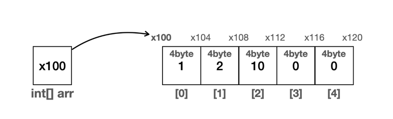
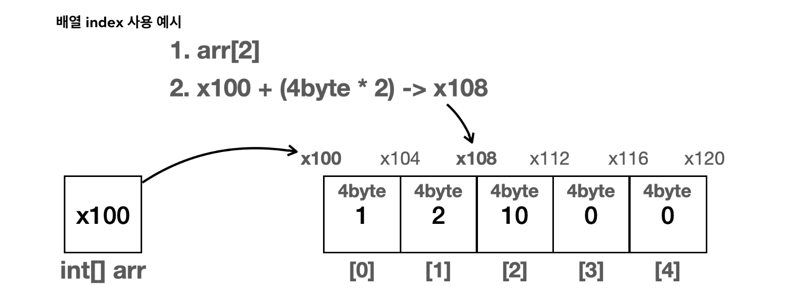
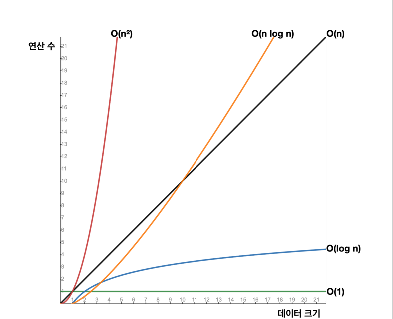

# 배열
가장 기본이 되는 자료구조

## 배열의 특징 
- 배열에서 자료를 찾을 때 인덱스(index)를 사용하면 매우 빠르게 자료를 찾을 수 있다.
- 인덱스를 통한 입력, 변경, 조회의 경우 한번의 계산으로 자료의 위치를 찾을 수 있다.

- arr[2] 에 위치한 자료를 찾는다고 가정해보자.
- 배열은 메모리상에 순서대로 붙어서 존재한다.
- int 는 4byte 를 차지한다.
- 따라서 배열의 시작 위치인 x100 부터 시작해서 자료의 크기(4byte)와 인덱스 번호를 곱하면 원하는 메모리 위치를 찾을 수 있다.
- 배열의 시작 참조(x100) + (자료의 크기(4byte) * 인덱스 위치(2)) = x108이 나온다. 여기에는 숫자 10이 들어있다.

## 배열의 인덱스
배열의 경우 인덱스를 사용하면 한번의 계산으로 매우 효율적으로 자료의 위치를 찾을 수 있다. 인덱스를 통한 입력, 변경, 조회 모두 한번의 계산으로 필요한 위치를 찾아서 처리할 수 있다. 정리하면 배열에서 인덱스를 사용하는 경우 데이터가 아무리 많아도 **한 번의 연산**으로 필요한 위치를 찾을 수 있다.

## 배열의 검색
n번 루프를 돌면서 데이터를 찾아야 한다. 

---

# 빅오(O) 표기법

대략적인 알고리즘 실행 시간을 예상해보는 방법 

---
# 배열의 특징2 - 데이터 추가
배열에 데이터를 추가하는 위치에 따라 크게 3가지로 나눌 수 있다.
- 배열의 첫번째 위치에 추가
- 배열의 중간 위치에 추가
- 배열의 마지막 위치에 추가

## 배열에 데이터를 추가할 때 위치에 따른 성능 변화
- 배열의 첫번째 위치에 추가
  - 배열의 첫번째 위치를 찾는데는 인덱스를 사용하므로 O(1)이 걸린다.
  - 모든 데이터를 배열의 크기만큼 한 칸씩 이동해야 한다. 따라서 O(n) 만큼의 연산이 걸린다.
  - O(1 + n) O(n)이 된다.
- 배열의 중간 위치에 추가
  - 배열의 위치를 찾는데는 O(1)이 걸린다.
  - index의 오른쪽에 있는 데이터를 모두 한 칸씩 이동해야 한다. 따라서 평균 연산은 O(n/2)이 된다.
  - O(1 + n/2) O(n)이 된다.
- 배열의 마지막 위치에 추가
  - 이 경우 배열이 이동하지 않고 배열의 길이를 사용하면 마지막 인덱스에 바로 접근할 수 있으므로 한번의 계산으로 위치를 찾을 수 있고, 기존 배열을 이동하지 않으므로 O(1)이 된다.

## 배열의 한계
배열은 가장 기본적인 자료 구조이고, 특히 인덱스를 사용할 때 최고의 효율이 나온다. 하지만 이런 배열에는 큰 단점이 있다. `바로 배열의 크기를 배열을 생성하는 시점에 미리 정해야 한다는 점이다.`

예를 들어서 이벤트를 하는데, 누구나 이벤트에 참여할 수 있고, 이벤트가 끝나면 추첨을 통해서 당첨자를 정한다고 가정해보자. 이때 이벤트에 참여하는 사용자를 배열에 보관한다고 가정하자. 사용자들은 실시간으로 계속 추가된다. 이때 넉넉하게 길이가 1000인 배열을 사용했는데, 예상보다 이벤트 참여자가 많아서 1000명을 넘게 된다면 더 많은 사용자가 이벤트에 참여하지 못하는 문제가 발생한다. 

그렇다고 `처음부터 너무 많은 배열을 확보하면 메모리가 많이 낭비된다.` 배열처럼 처음부터 정적으로 길이가 정해져있는 것이 아니라, 동적으로 언제든지 길이를 늘리고 줄일 수 있는 자료 구조가 있다면 편리할 것이다.

---
# 직접 구현한 배열 리스트1 - 시작