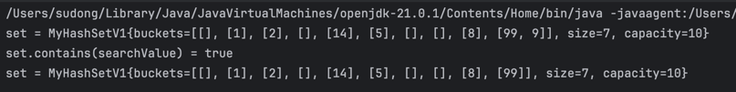

# 직접 구현하는 Set
Set은 중복을 허용하지 않고, 순서 보장이 되지 않는 자료구조.

## hashSet 성능 개선 : O(n) -> O(1)
이전에 구현한 set의 경우에는 add 를 할 때, 중복을 확인하기 위해서 loop를 돈다.
이로 인해서 O(n)의 시간이 걸린다.
contains로 할 때도 O(n)이 걸린다.

이걸 해쉬 알고리즘을 사용해서 O(1)로 변경해보자.

hashSet은 연결리스트를 요소로 가지고 있는 배열이다.

```java
public boolean add(int value) {
        int hashIndex = hashIndex(value);
        LinkedList<Integer> bucket = buckets[hashIndex];
        if(bucket.contains(value)) {
           return false;
        }
        bucket.add(value);
        size++;
        return true;
    }

private int hashIndex(int value) {
    return value % capacity;
}
```



hashIndex를 사용해서 성능을 개선시킬 수 있다. (물론 최악의 경우에는 O(n)이 될 수는 있다.)

## 문자를 저장하는 방법
hashIndex()의 경우 숫자만 할 수 있었다. 이걸 문자도 가능하도록 개선시켜보자.

각 문자는 아스키 코드의 숫자로 변환시킬 수 있음을 이용하면 된다.
```java
private static int hashCode(String string) {
        char[] charArray = string.toCharArray();
        int sum = 0;
        for(char c : charArray) {
            sum += c;
        }
        return sum;
    }
```

## 자바의 HashCode
HashSet을 이용하기 위해서는 HashIndex를 가질 수 있어야 한다.
-> 자바는 모든 객체가 해쉬코드를 반환할 수 있도록 메서드를 제공한다

`Object.hashCode()`

객체의 참조값으로 해쉬코드를 만든다. 그래서 hashCode와 Equals를 재정의 해주지 않으면, 인스턴스가 다를 시 특정 상태가 같아도 다른 hashCode를 반환해준다.


이걸 바탕으로 MyHashSetV2를 만들어본다면, 
1) 입력받는 값을 int 에서 Object로 변경한다.
2) hashIndex를 구하는 곳을 `value % capacity`에서 바꾼다.
```java
private int hashIndex(Object value) {
        return Math.abs(value.hashCode()) % capacity;
    }
```
3) remove에서 `boolean result = bucket.remove(value);` value가 Object 객체이므로 그냥 넘겨도 된다.

## Equals, hashCode의 중요성
hi와 jpa는 hashIndex가 같다. 만약 hi로 저장하고 jpa로 검색한 경우, equals()로 확인해야지만 정확한 판단이 가능하다.

hashCode를 설정해주지 않으면, 해쉬값이 다르기 때문에 내가 의도하기로는 같은 값도 다른 값으로 인식된다.
즉 다른 위치에 같은 값이 중복으로 들어가진다. -> 검색도 제대로 먹지 않는다.
equals를 구현해주지 않으면, hashCode로 같은 위치에 들어와도 참조값이 다르기 때문에 다른 값으로 인식된다.

해쉬 자료구조르 쓸 때는 둘다 구현해야 정상적으로 작동한다.

## 제네릭과 인터페이스 도입


